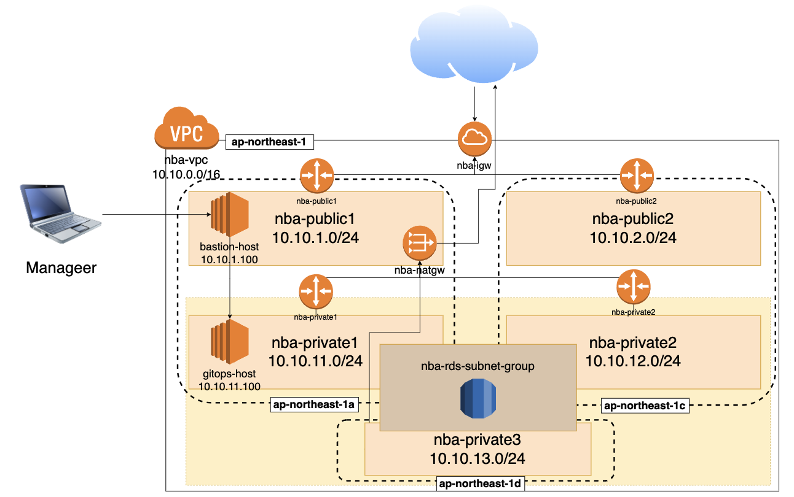
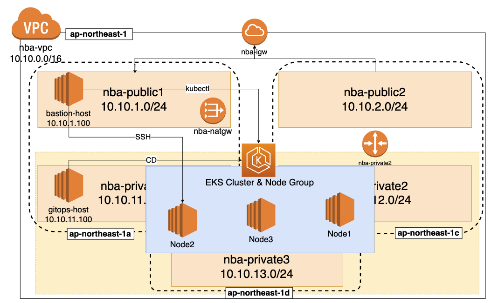

## Introduction

Infra Provisioning In AWS With Terraform

- Please use it after receiving the Access Key and Secret Key.
  - I saved the authentication information locally through aws-cli.
- All components are built based on the project team name.
- If necessary, you can change the **NBA**.
- If you use it, check the compute type of the instance carefully.
- For EKS, Dataplane was used as the Node Group rather than Fargate.

## Notification

- If you run this code to provision EKS and RDS, you will likely be charged.
- Please note that the parts about RDS, EKS, and NodeGroup are not commented out.
- So please refer to it if necessary.

## Diagram for reference

### EKS & Node Group

## Components

1. **aws_vpc (VPC):**

   - **Purpose:** A Virtual Private Cloud (VPC) is essential for isolating resources and controlling the network environment, defining the network environment for all resources.

2. **aws_subnet (Subnet - Public and Private):**

   - **Purpose:** Subnets define network segments where EC2 instances and other service resources are placed. Public and private subnets enable routing of resources to the internet or private network.

3. **aws_internet_gateway (Internet Gateway):**

   - **Purpose:** An Internet Gateway facilitates communication between the VPC and the internet, allowing connectivity from public subnets to the internet.

4. **aws_route_table (Routing Table):**

   - **Purpose:** Routing tables are required for routing traffic within subnets. They configure routing for public and private subnets.

5. **aws_nat_gateway (NAT Gateway) and aws_eip (Elastic IP):**

   - **Purpose:** NAT Gateway allows outbound internet access from private subnets, and Elastic IP provides a fixed public IP address for the NAT Gateway.

6. **aws_instance (EC2 Instances):**

   - **Purpose:** EC2 instances provide virtual machines for hosting applications and running tasks.

7. **aws_security_group (Security Groups):**

   - **Purpose:** Security Groups define inbound and outbound traffic rules for instances, enforcing security and network rules.

8. **aws_key_pair (Key Pairs):**

   - **Purpose:** Key Pairs provide authentication for remote access (SSH or RDP) to EC2 instances.
   - In the code above, the key pair exists in the part where the main.tf file operates.
   - You can create a Key-Pair in the AWS Web Console or separately and add it to the EC2(aws_instance > **key_name** ) section.

9. **aws_db_subnet_group (RDS Subnet Group) and aws_db_instance (RDS Database Instance):**

   - **Purpose:** RDS Subnet Group defines subnets for RDS databases, and RDS Database Instance provides hosted and managed databases.

10. **aws_eks_cluster (EKS Cluster) and aws_eks_node_group (EKS Node Group):**

    - **Purpose:** EKS Cluster and Node Group manage Kubernetes for containerized applications and orchestration.
    - Instead of Fargate, Node Group was used as the data plane.

11. **aws_eks_addon (EKS Addons):**
    - **Purpose:** EKS Addons provide additional functionality to EKS clusters, such as DNS service (CoreDNS), network interface (VPC CNI), and Kubernetes proxy (kube-proxy).
